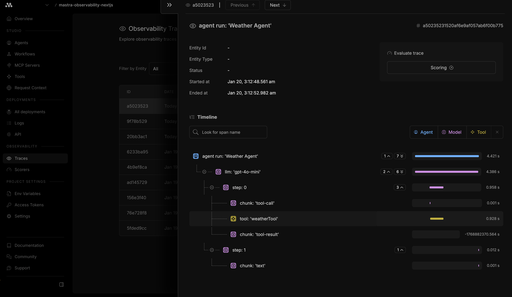

# Mastra Observability with Next.js

A Next.js application demonstrating [Mastra](https://mastra.ai) AI agent observability with real-time weather information. This template showcases how to integrate Mastra's observability features to monitor and evaluate agent performance in production deployments on [Vercel](https://vercel.com).



## Overview

This template demonstrates:

- **AI Agent Implementation**: A weather agent using OpenAI's GPT-4o-mini model
- **Tool Integration**: Custom weather tool using Open-Meteo API (free, no API key required)
- **Observability**: Full tracing and monitoring via Mastra Cloud
- **Memory Persistence**: PostgreSQL storage for agent conversation context
- **Production Ready**: Optimized for Vercel deployment with serverless functions

## Project Structure

```
src/mastra/
├── index.ts              # Mastra instance configuration
├── agents/
│   └── weather-agent.ts  # Weather agent with GPT-4o-mini
└── tools/
    └── weather-tool.ts   # Weather data fetching tool
```

## Prerequisites

- Node.js v22.13.0 or later
- pnpm, npm, or yarn
- PostgreSQL database (Neon recommended for serverless)
- OpenAI API key
- Mastra Cloud account (for observability)

## Environment Variables

Copy `.env.example` to `.env` and configure the following:

| Variable | Description | Get it from |
|----------|-------------|-------------|
| `OPENAI_API_KEY` | OpenAI API key for GPT-4o-mini | [OpenAI Platform](https://platform.openai.com/api-keys) |
| `DATABASE_URL` | PostgreSQL connection string | [Neon](https://neon.tech) |
| `MASTRA_CLOUD_ACCESS_TOKEN` | Mastra Cloud access token | [Mastra Cloud](https://cloud.mastra.ai) |

## Getting Started

1. **Clone the repository**
   ```bash
   git clone <repository-url>
   cd mastra-observability-nextjs
   ```

2. **Install dependencies**
   ```bash
   pnpm install
   # or npm install
   # or yarn install
   ```

3. **Configure environment variables**
   ```bash
   cp .env.example .env
   # Edit .env with your API keys
   ```

4. **Run the development server**
   ```bash
   pnpm dev
   # or npm run dev
   # or yarn dev
   ```

5. **Open the application**

   Navigate to [http://localhost:3000](http://localhost:3000)

## Usage

1. Enter a city name in the search field
2. Click "Get Weather" to fetch current weather data
3. The AI agent will provide weather information including:
   - Current temperature and "feels like" temperature
   - Humidity levels
   - Wind speed and gusts
   - Weather conditions (clear, cloudy, rain, etc.)

## Observability

This template integrates with Mastra Cloud for comprehensive observability:

- **Trace Visualization**: View complete agent execution traces
- **Performance Monitoring**: Track response times and token usage
- **Error Tracking**: Monitor and debug agent failures
- **Evaluation**: Assess agent response quality

Access your traces at [Mastra Cloud Dashboard](https://cloud.mastra.ai).

## Customization

### Adding New Tools

Create a new tool in `src/mastra/tools/`:

```typescript
import { createTool } from "@mastra/core/tools";
import { z } from "zod";

export const myTool = createTool({
  id: "my-tool",
  description: "Description of what this tool does",
  inputSchema: z.object({
    param: z.string().describe("Parameter description"),
  }),
  outputSchema: z.object({
    result: z.string(),
  }),
  execute: async ({ context }) => {
    // Tool implementation
    return { result: "..." };
  },
});
```

### Modifying Agent Behavior

Edit the agent instructions in `src/mastra/agents/weather-agent.ts` to customize how the agent responds to queries.

### Using Different LLM Providers

Change the model in the agent configuration:

```typescript
// OpenAI
model: "openai/gpt-4o-mini"

// Anthropic
model: "anthropic/claude-3-haiku-20240307"

// Google
model: "google/gemini-1.5-flash"
```

## Deployment

### Vercel (Recommended)

1. Push your code to GitHub
2. Import the repository in [Vercel](https://vercel.com)
3. Configure environment variables in Vercel dashboard
4. Deploy

### Other Platforms

Ensure your deployment platform supports:
- Node.js v22.13.0+
- Environment variables
- PostgreSQL connection

## Learn More

- [Mastra Documentation](https://mastra.ai/docs)
- [Mastra Observability Guide](https://mastra.ai/observability)
- [Next.js Documentation](https://nextjs.org/docs)
- [Open-Meteo API](https://open-meteo.com/en/docs)

## License

MIT
